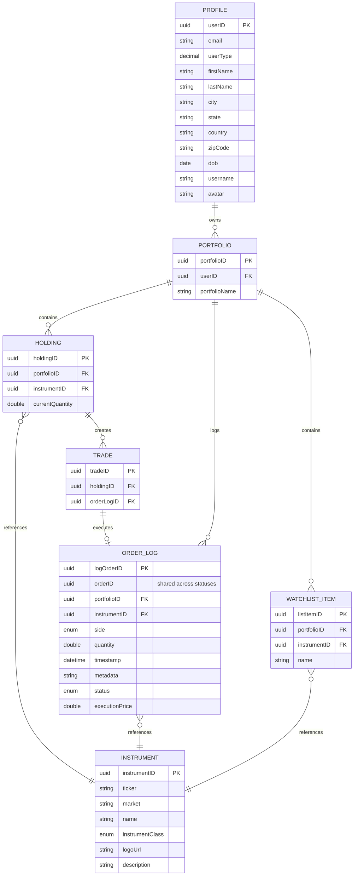

# Entity Relationship Diagram

## Domain Model

## Key Relationships

### Ownership Hierarchy
- **Profile** → **Portfolio** (1:N) - Users own multiple portfolios
- **Portfolio** → **Holding** (1:N) - Portfolios contain multiple holdings with cascade delete
- **Portfolio** → **WatchlistItem** (1:N) - Portfolios contain multiple watchlist items with cascade delete

### Reference Data
- **Holding** → **Instrument** (N:1) - One-way reference to master data, no cascade
- **OrderLog** → **Instrument** (N:1) - One-way reference to master data, no cascade
- **WatchlistItem** → **Instrument** (N:1) - One-way reference to master data, no cascade

### Order & Trade Tracking
- **Portfolio** → **OrderLog** (1:N) - Historical order records grouped by orderId, no cascade
- **OrderLog** → **Trade** (0..1) - Orders may or may not be executed; executed orders create exactly one trade, no cascade
- **Holding** → **Trade** (1:N) - Trades linked to holdings with cascade delete

## Cascade Rules

| Relationship | Cascade Type | Orphan Removal |
|---|---|---|
| Portfolio → Holding | REMOVE | Yes |
| Portfolio → WatchlistItem | REMOVE | Yes |
| Holding → Trade | ALL | Yes |
| All others | None | No |

## Special Fields

- **OrderLog.orderID**: Shared UUID across multiple OrderLog records for the same logical order through its lifecycle (PENDING → EXECUTED/CANCELLED)
- **OrderLog.logOrderID**: Unique identifier for each individual state record

## Relationship Patterns

### Bidirectional Relationships
- **Composition** (Ownership): Profile ↔ Portfolio, Portfolio ↔ Holding, Portfolio ↔ WatchlistItem, Holding ↔ Trade
  - These represent ownership hierarchies with cascade delete and orphan removal
  - Navigable from parent to child collections in code
- **Audit Trail**: Portfolio ↔ OrderLog
  - Bidirectional for historical querying and compliance auditing

### Unidirectional Relationships
- **Reference Data**: Holding → Instrument, OrderLog → Instrument, WatchlistItem → Instrument
  - One-way FKs to master data
  - No reverse navigation in entities (query via repositories if needed)
- **Execution Link**: Trade → OrderLog
  - One-way reference to audit record
  - OrderLog is immutable historical record
