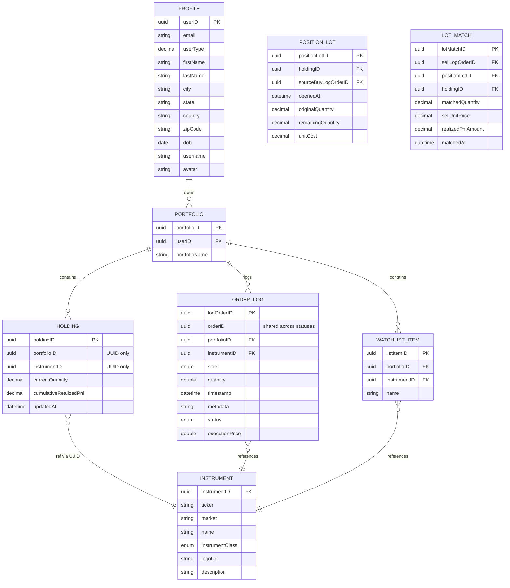

# Entity Relationship Diagram

## Domain Model

> **Architecture Note (2026-09-24):** `OrderLog` remains the source of truth. `Holding` is now a persisted projection keyed by `(portfolioID, instrumentID)` and updated by FIFO accounting using `PositionLot` and `LotMatch`.

## Key Relationships

### Ownership Hierarchy
- **Profile** → **Portfolio** (1:N)
- **Portfolio** → **Holding** (1:N)
- **Portfolio** → **WatchlistItem** (1:N)

### Reference Data
- **Holding** → **Instrument** (N:1) by UUID
- **OrderLog** → **Instrument** (N:1)
- **WatchlistItem** → **Instrument** (N:1)

### Execution / Aggregation
- **Portfolio** → **OrderLog** (1:N)
- **Holding** is a persisted projection updated on each EXECUTED BUY/SELL
- **PositionLot** stores FIFO buy lots
- **LotMatch** stores sell-to-lot realization slices for audit and realized PnL

## Special Fields

- **OrderLog.orderID**: Shared UUID for a logical order lifecycle (SUBMITTED → EXECUTED/FAILED).
- **OrderLog.logOrderID**: Unique row identifier for each lifecycle event.
