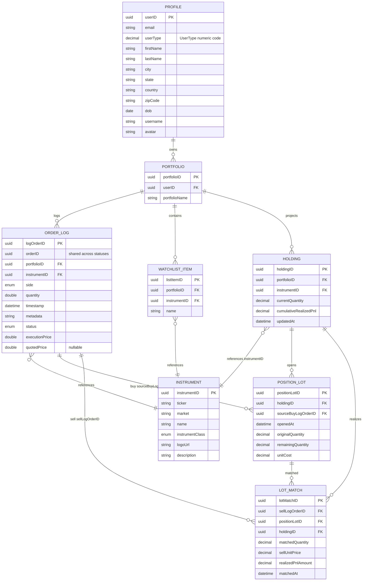

# Entity Relationship Diagram

## Domain Model

> **Architecture Note (2026-09-30):** `OrderLog` is the source of truth for order lifecycle state. `Holding` is a persisted projection keyed by `(portfolioID, instrumentID)` and FIFO accounting is captured by `PositionLot` and `LotMatch`.

```mermaid
erDiagram
  PROFILE ||--o{ PORTFOLIO : owns
  PORTFOLIO ||--o{ ORDER_LOG : logs
  PORTFOLIO ||--o{ WATCHLIST_ITEM : contains
  PORTFOLIO ||--o{ HOLDING : projects

  HOLDING }o--|| INSTRUMENT : "references instrumentID"
  ORDER_LOG }o--|| INSTRUMENT : "references"
  WATCHLIST_ITEM }o--|| INSTRUMENT : "references"

  HOLDING ||--o{ POSITION_LOT : opens
  ORDER_LOG ||--o{ POSITION_LOT : "buy sourceBuyLogOrderID"
  ORDER_LOG ||--o{ LOT_MATCH : "sell sellLogOrderID"
  POSITION_LOT ||--o{ LOT_MATCH : matched
  HOLDING ||--o{ LOT_MATCH : realizes

  PROFILE {
    uuid userID PK
    string email
    decimal userType "UserType numeric code"
    string firstName
    string lastName
    string city
    string state
    string country
    string zipCode
    date dob
    string username
    string avatar
  }

  PORTFOLIO {
    uuid portfolioID PK
    uuid userID FK
    string portfolioName
  }

  HOLDING {
    uuid holdingID PK
    uuid portfolioID FK
    uuid instrumentID FK
    decimal currentQuantity
    decimal cumulativeRealizedPnl
    datetime updatedAt
  }

  POSITION_LOT {
    uuid positionLotID PK
    uuid holdingID FK
    uuid sourceBuyLogOrderID FK
    datetime openedAt
    decimal originalQuantity
    decimal remainingQuantity
    decimal unitCost
  }

  LOT_MATCH {
    uuid lotMatchID PK
    uuid sellLogOrderID FK
    uuid positionLotID FK
    uuid holdingID FK
    decimal matchedQuantity
    decimal sellUnitPrice
    decimal realizedPnlAmount
    datetime matchedAt
  }

  INSTRUMENT {
    uuid instrumentID PK
    string ticker
    string market
    string name
    enum instrumentClass
    string logoUrl
    string description
  }

  ORDER_LOG {
    uuid logOrderID PK
    uuid orderID "shared across statuses"
    uuid portfolioID FK
    uuid instrumentID FK
    enum side
    double quantity
    datetime timestamp
    string metadata
    enum status
    double executionPrice
    double quotedPrice "nullable"
  }

  WATCHLIST_ITEM {
    uuid listItemID PK
    uuid portfolioID FK
    uuid instrumentID FK
    string name
  }
```

## Key Relationships

### Ownership Hierarchy
- **Profile** → **Portfolio** (1:N)
- **Portfolio** → **Holding** (1:N persisted projection)
- **Portfolio** → **WatchlistItem** (1:N)

### Reference Data
- **Holding** → **Instrument** (N:1)
- **OrderLog** → **Instrument** (N:1)
- **WatchlistItem** → **Instrument** (N:1)

### Execution / Accounting
- **Portfolio** → **OrderLog** (1:N)
- **Holding** → **PositionLot** (1:N)
- **OrderLog (BUY)** → **PositionLot** via `sourceBuyLogOrderID` (1:0..1 per buy log)
- **OrderLog (SELL)** → **LotMatch** via `sellLogOrderID` (1:N)
- **PositionLot** → **LotMatch** (1:N)
- **Holding** → **LotMatch** (1:N)

## Special Fields

- **OrderLog.orderID**: Shared UUID for a logical order lifecycle (SUBMITTED → PENDING → ACCEPTED/REJECTED → EXECUTED/FAILED/CANCELLED).
- **OrderLog.logOrderID**: Unique identifier for each lifecycle event row.
- **Profile.userType**: Stored as numeric code mapped by `UserType` enum/converter.
